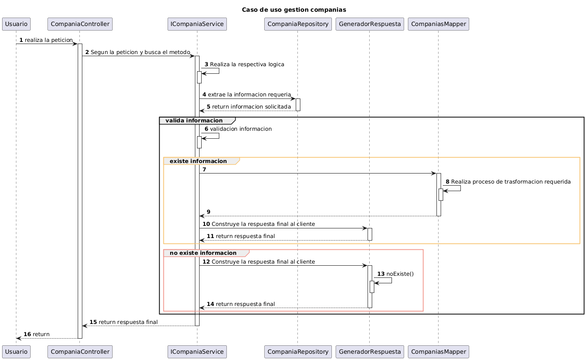
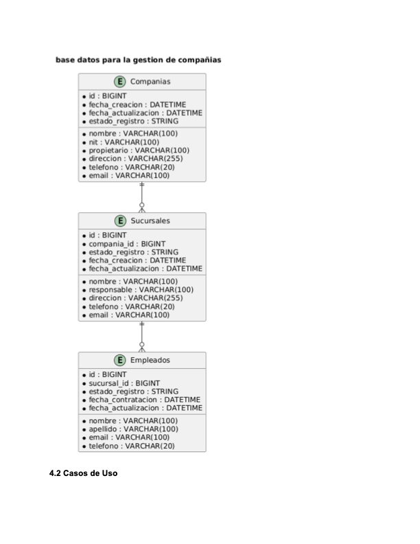

# Gestion compañias

## Introducción
La empresa JVN Tecnologías busca desarrollar un sistema de información para la gestión de compañías y sucursales. El sistema debe manejarse a través de microservicios independientes para facilitar la reutilización del código y permitir una arquitectura escalable. Este documento detalla el levantamiento de requerimientos y el análisis de solución para el microservicio de Gestión de Compañías.

## Requerimientos
### Descripción General
El microservicio de Gestión de Compañías se encargará de:
- Registrar y gestionar la información de las compañías.
- Registrar y gestionar la información de las sucursales asociadas a las compañías.
- Permitir la actualización y eliminación de compañías y sucursales.
- Proporcionar APIs para acceder y manipular la información de las compañías y sucursales.
- 
### Funcionalidades
- GestióndeCompañías
- Crear una nueva compañía.
-  Actualizar una compañía
- Eliminar la compañía
- Listar las compañías registradas en el sistema
-  Buscar una compañía por ID.
- Eliminar una compañía, siempre que no tenga sucursales asociadas.
#### Registro de Sucursales
- Crear una nueva sucursal para una compañía existente.
- Obtener la lista de todas las sucursales.
- Buscar una sucursal por ID.
- Actualizar la información de una sucursal.
- Eliminar una sucursal, siempre que no tenga empleados asociados.

#### Registro de Empleados
- Crear un empleado asociado a una sucursal existente y activa.
- Obtener la lista de todos los empleados.
- Buscar un empleado por ID.
- Actualizar la información de un empleado.
- Eliminar un empleado.

## Diagrama de Arquitectura
Diagrama de Arquitectura del Microservicio de Gestión de Compañías:
- Controlador: Interactúa con las peticiones HTTP.
- Servicio: Contiene la lógica de negocio.
- Repositorio: Acceso a la base de datos.
- Entidad: Representa las tablas de la base de datos.
- DTO: Estructuras de datos para la comunicación.

## Análisis de Solución
### Diseño de Base de Datos

## Gestión de Compañía
#### Registrar Compañía
- El usuario envía una solicitud POST con los datos de la compañía.
- El sistema valida y guarda la compañía en la base de datos.
- Respuesta: Confirmación de éxito o error.
#### Actualizar Compañía
- El usuario envía una solicitud PUT con los datos actualizados de la compañía.
- El sistema actualiza la información en la base de datos.
- Respuesta: Confirmación de éxito o error.
#### Eliminar Compañía
- El usuario envía una solicitud DELETE para eliminar una compañía.
- El sistema verifica si la compañía tiene sucursales asociadas antes de eliminarla.
- Respuesta: Confirmación de éxito o error.
#### Buscar Compañía por ID
- El usuario envía una solicitud GET con el ID de la compañía.
- El sistema busca la compañía en la base de datos y devuelve los detalles.
- Respuesta: Información de la compañía o mensaje de error si no se encuentra.
## Gestión de Sucursales
#### Registrar sucursal
- El usuario envía una solicitud POST con los datos de la sucursal.
- El sistema valida, verifica si la compañía asocial la sucursal esta activa y guarda la sucursal en la base de datos.
- Respuesta: Confirmación de éxito o error.
#### Actualizar Compañía
- El usuario envía una solicitud PUT con los datos actualizados de la sucursal.
- El sistema actualiza la información en la base de datos.
- Respuesta: Confirmación de éxito o error.
#### Eliminar Compañía
- El usuario envía una solicitud DELETE para eliminar una sucursal.
- El sistema verifica si la sucursal tiene empleados asociadas antes de eliminarla.
- Respuesta: Confirmación de éxito o error.
#### Buscar Compañía por ID
- El usuario envía una solicitud GET con el ID de la sucursal.
- El sistema busca la sucursal en la base de datos y devuelve los detalles.
- Respuesta: Información de la compañía o mensaje de error si no se encuentra.

## Gestión de Empleados
#### Registrar empleado
- El usuario envía una solicitud POST con los datos del empleado.
- El sistema valida y guarda la empleado en la base de datos.
- Respuesta: Confirmación de éxito o error.
#### Actualizar empleado
- El usuario envía una solicitud PUT con los datos actualizados del empleado.
- El sistema actualiza la información en la base de datos.
- Respuesta: Confirmación de éxito o error.
#### Eliminar empleado
- El usuario envía una solicitud DELETE para eliminar el empleado.
- El sistema verifica si el empleado antes de eliminarlo.
- Respuesta: Confirmación de éxito o error.
#### Buscar empleado por ID
- El usuario envía una solicitud GET con el ID del empleado.
- El sistema busca el empleado en la base de datos y devuelve los detalles.
- Respuesta: Información de la compañía o mensaje de error si no se encuentra.
- 
## Authors

- [@JCTandrade](https://github.com/JCTandrade)